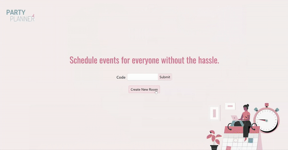
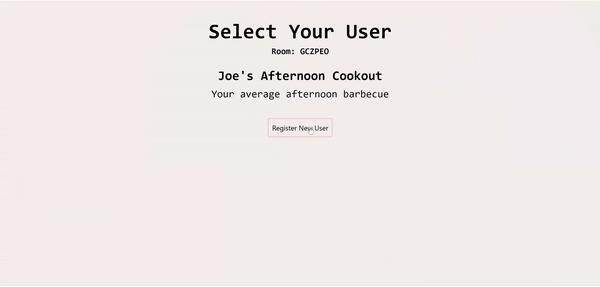

# 📅 Party Planner: The easy way to plan an event.

## How it works

### Create a room

Create a room for your event on the homepage. Come up with a name and description for your event, then select the potential days on the calendar and the time range you would like. Share this room code with attendees to allow them to sign up and fill in their availabilities!

### Create an account

Your room is now created! Now you will need to create your user for this room. There is **no email sign-up** required and your username is unique for each room! Feel free to protect your account from pesky friends using a password or a security question. Whenever you return to this room, you will be automatically logged in with your respective account.

