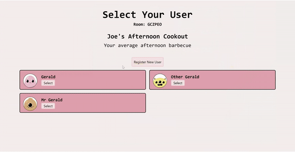
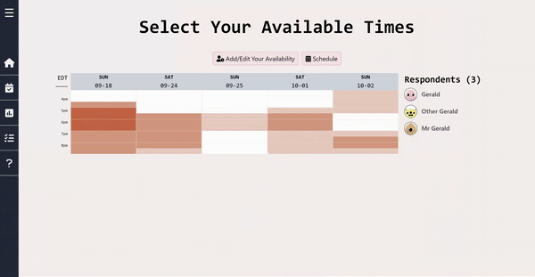
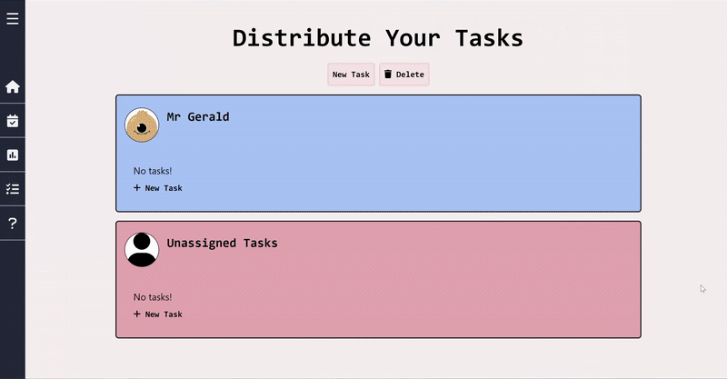
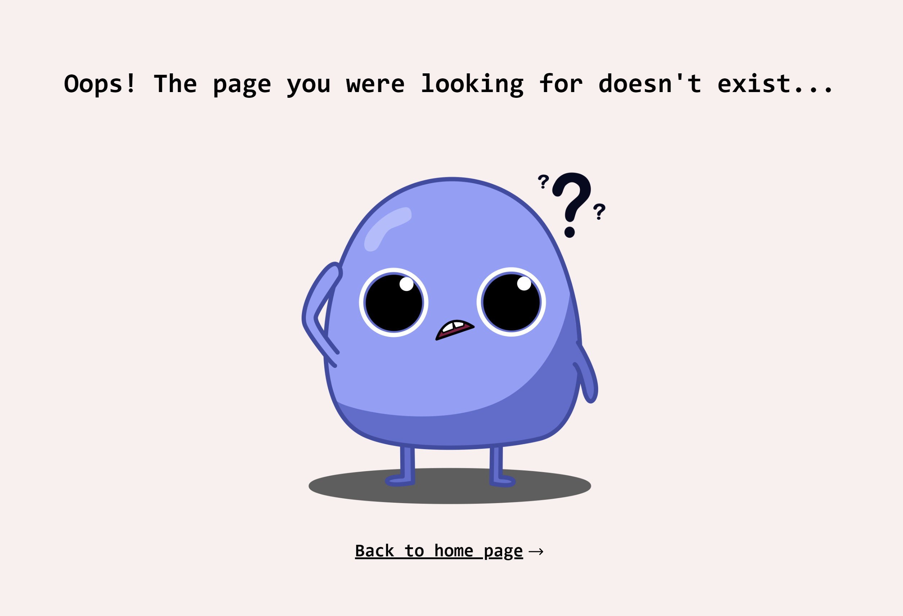

# 📅 Party Planner: The easy way to plan an event.

## 🔨 How it works 🔨

### Create a room
Create a room for your event on the homepage. Come up with a name and description for your event, then select the potential days on the calendar and the time range you would like. Share this room code with attendees to allow them to sign up and fill in their availabilities!

### Create an account
Your room is now created! Now you will need to create your user for this room. There is **no email sign-up** required and your username is unique for each room! Feel free to protect your account from pesky friends using a password or a security question. Whenever you return to this room, you will be automatically logged in with your respective account.

### Select your available times
Time to find a time where everyone is available! Each user will fill in their availability for the date(s) selected, which will be displayed for everyone to see. Hover over each slot to see who is available.

### Schedule your event time
Now that you have everyone's availabilities, it's time to schedule your event! Find a time slot where everyone (hopefully) is available and select it. The time is now updapted on the screen in real time!

### Distribute tasks
In case you wish to delegate tasks amongst each other, Party Planner has you covered! It offers a priority-based task page where you can assign tasks to anyone, and it updates instantly! You can also check off tasks or delete them as you please.

### Vote on polls
Party Planner also offers a polling system for the indecisive bunch. You can create multiple polls and anybody can vote on it once. **Demo coming soon!**

### Don't get lost!

